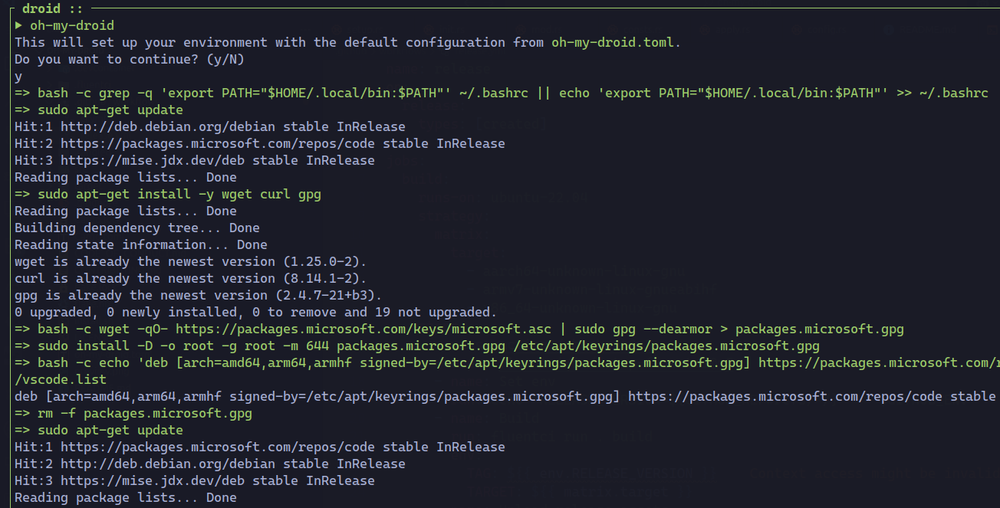

# oh-my-droid
[](https://github.com/tsirysndr/oh-my-droid/actions/workflows/ci.yml)

Turn a fresh Android 15+ Linux Terminal into a fully-configured, beautiful, and modern web development system by running a single command.

## Features
- Easy installation of essential development tools
- Pre-configured environment for web development
- Customizable settings for individual preferences
- [Atuin](https://atuin.sh/) integration for enhanced command history
- [Zoxide](https://github.com/ajeetdsouza/zoxide) integration for improved directory navigation
- [ble.sh](https://github.com/akinomyoga/ble.sh) integration for a better terminal experience
- [Pkgx](https://github.com/pkgxdev/pkgx) package manager for easy software installation
- [Mise](https://github.com/jdx/mise) integration for a modern command-line experience
- [Stow](https://www.gnu.org/software/stow) integration for managing dotfiles
- [Nix](https://github.com/NixOS/nix) package manager
- SSH support for secure remote access
- [Tailscale](https://tailscale.com/) integration for secure access to your devices
- Pre-installed [VS Code](https://code.visualstudio.com/)
- Pre-installed [NeoVim](https://neovim.io/)
- [Oh My Posh](https://ohmyposh.dev/) integration for a beautiful prompt
- Alias setup for ls: `alias ls='eza -lh'`




## Installation

Run the following command to install `oh-my-droid`:

```bash
curl -sSfL https://raw.githubusercontent.com/tsirysndr/oh-my-droid/main/install.sh | bash
```

## Configuration

Run the following command to create an initial configuration `oh-my-droid.toml`:

```bash
oh-my-droid init
```

```toml
apt-get = ["build-essential", "curl", "git", "gawk", "wget", "unzip", "autoconf", "automake", "cmake", "tmux", "openssh-server", "openssh-client", "httpie", "code", "screenfetch", "stow"]
"ble.sh" = true
zoxide = true
tailscale = false

[stow]
git = "github:tsirysndr/android-dotfiles"

[mise]
node = "latest"

[pkgx]
tig = "latest"
rg = "latest"
fzf = "latest"
zellij = "latest"
glow = "latest"
eza = "latest"
"neovim.io" = "latest"
gh = "latest"
jq = "latest"

[curl]
oh-my-posh = "https://ohmyposh.dev/install.sh"
atuin = "https://setup.atuin.sh"
pkgx = "https://pkgx.sh"
deno = "https://deno.land/install.sh"
bun = "https://bun.sh/install"

[oh_my_posh]
theme = "tokyonight_storm"

[alias]
ls = "eza -lh"

[ssh]
port = 8022
authorized_keys = []
```

You can customize it and run `oh-my-droid apply` to apply the changes.
